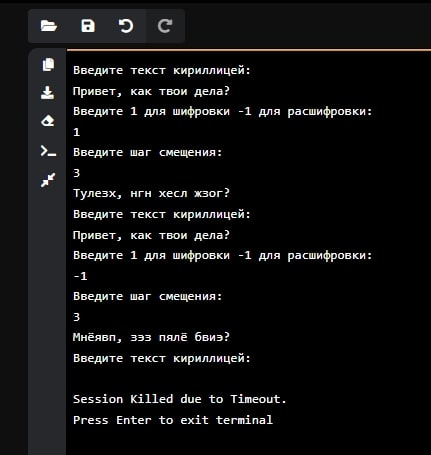

### Исполнитель: Филиппов Кирилл Фт-220007

---

## Шифр Цезаря
* Задание: Написать на любом языке программу: шифрование и расшифровка текста шифром Цезаря. 
Пользователь вводит строку и шаг сдвига. Заглавные символы должны быть заменены заглавными, цифры и знаки препинания оставить без изменения.  
---

Открыть проект можно в Visual Studio Code или PyCharm 2023.

---
Для запуска программы открыть: /main.py. Вводиться с клавиатуры текст кириллицой, затем пользователь выбирает либо зашифровать, либо расшифровать, а затем программа выдает зашифрованный текст

* main.py - файл для запуска программы

---

### ### [Мой GitHub](https://github.com/ste1wallF)